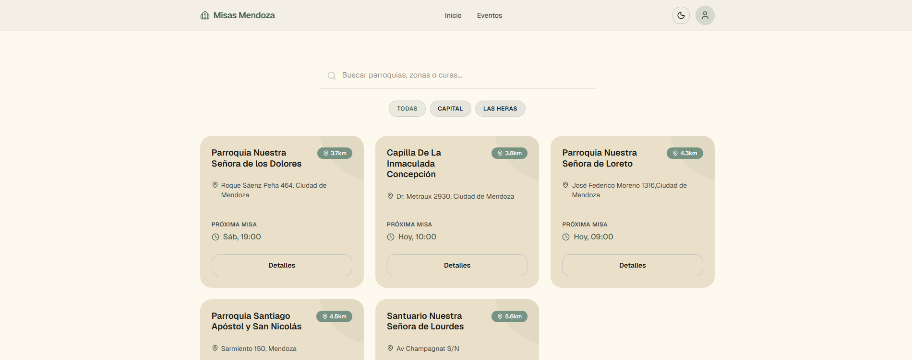
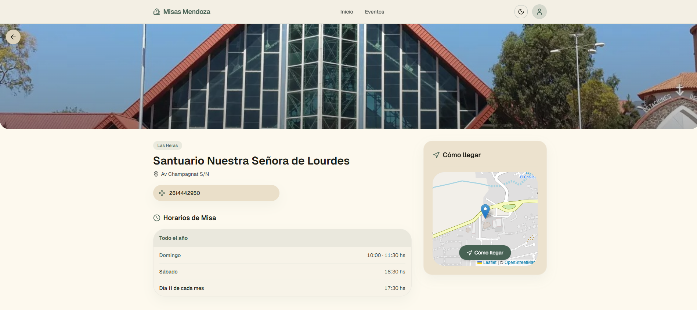

# Misas Mendoza

**Misas Mendoza** nace para responder una pregunta simple que hoy no tiene una respuesta fácil: *¿a qué hora hay misa cerca mío?* Los horarios de las parroquias y capillas de Mendoza están dispersos entre carteleras, redes sociales y el boca a boca; esta aplicación web los reúne en un solo lugar, gratuito y accesible desde cualquier celular, sin necesidad de registrarse ni descargar nada.

El proyecto tiene dos caras: un **sitio público** donde cualquier persona encuentra misas por cercanía, día y horario, y un **panel de administración** donde voluntarios autorizados mantienen los datos de su zona al día. Contempla las realidades concretas de las parroquias mendocinas: horarios que cambian entre invierno y verano (cuando cada parroquia lo decide), misas mensuales especiales que reemplazan a las del día, y eventos de la comunidad.

Fue creado y es mantenido por voluntarios ([@XxFabio24xX](https://github.com/XxFabio24xX)), sin fines de lucro y con infraestructura de costo cero, con la idea de sumar más voluntarios por zona a medida que crezca la cobertura.

> **Stack:** Next.js 16 · Supabase (PostgreSQL + PostGIS) · Tailwind CSS v4 · TypeScript · Vitest

📋 **¿Vas a trabajar en el proyecto desde otra PC?** Seguí el paso a paso en [DESARROLLO.md](DESARROLLO.md).

---

## Capturas de Pantalla

### Inicio — Capillas cercanas



### Detalle de Capilla



---

## Funcionalidades

### Sitio Público

Es la cara visible del proyecto: está pensado para que cualquier persona —sin importar su edad o manejo de la tecnología— encuentre una misa en segundos. Al abrirlo, las capillas más cercanas aparecen primero (si la persona comparte su ubicación) con la hora de su próxima misa ya calculada.

| Pantalla | Descripción |
|---|---|
| **Inicio (`/`)** | Hero banner, buscador (insensible a tildes) y capillas ordenadas por distancia al usuario (geolocalización + PostGIS). Filtros combinables por localidad, día de misa (chips **Hoy**/Lun-Vie/Sábado/Domingo + días individuales) y franja horaria (Mañana/Tarde/Noche). Favoritas fijadas arriba. La "Próxima Misa" respeta la temporada vigente y las misas mensuales con reemplazo. |
| **Detalle capilla (`/capilla/[slug]`)** | Foto optimizada (`next/image`), botones de favorito y compartir (Web Share API), datos de contacto, badge de Cáritas, horarios por temporada con la vigente destacada ("Vigente ahora"), misas mensuales fijas, y mapa con "Cómo llegar". |
| **Eventos (`/eventos`)** | Listado de eventos vigentes (los pasados se ocultan solos) con filtros por tipo y departamento. Detalle en `/eventos/[slug]` con botón **"Agregar al calendario"** (.ics) y mapa si tiene capilla asociada. |
| **Mapa (`/mapa`)** | Mapa global con pins de todas las capillas activas, tooltips y popups con acceso al detalle. |
| **Acerca (`/acerca`)** | Qué es el proyecto y cómo colaborar como voluntario. |

Las URLs públicas usan **slugs** legibles (`/capilla/parroquia-santiago-apostol`) generados automáticamente desde el nombre; los links viejos con UUID redirigen con 301. Hay favoritos persistidos en `localStorage` (sin cuenta), modo claro/oscuro, **PWA instalable con soporte offline básico** (service worker propio, sin Workbox — cachea assets estáticos y páginas ya visitadas), metadata Open Graph + structured data (JSON-LD) por página (vista previa al compartir por WhatsApp, resultados enriquecidos en Google), `sitemap.xml` dinámico, `robots.txt` y Vercel Analytics.

#### Temporadas y casos especiales de horarios

- Cada parroquia define **cuándo** cambia sus horarios de invierno/verano, así que la vigencia es un switch manual (`temporada_actual`) que el voluntario actualiza desde el editor de horarios cuando la parroquia lo anuncia.
- Las **misas mensuales fijas** (ej. misa de los enfermos los 11) pueden marcarse con "reemplaza las misas del día": esa fecha se ofrece como única misa.
- Los horarios especiales puntuales (que no siguen ninguna regla) se difunden como **Eventos**.

### Panel de Administración (`/admin`)

Detrás del sitio público hay un panel al que solo acceden voluntarios con usuario y contraseña, desde el celular o la computadora. El diseño sigue un principio de prudencia: cada voluntario solo edita lo que le corresponde, y las acciones delicadas requieren una segunda aprobación — así un error local nunca borra ni cambia datos de forma permanente.

Acceso protegido por login (sesión en cookies vía `@supabase/ssr` + `proxy.ts`, con auto-logout a la hora de inactividad). Tres roles:

- **Super Admin:** acceso completo a todas las secciones y departamentos. Aprueba o rechaza cualquier solicitud.
- **Admin Departamental:** edita capillas, horarios y eventos directo, pero solo en su propio departamento. Aprueba o rechaza las solicitudes de su zona.
- **Editor:** propone cambios en las capillas, horarios sueltos y eventos de su departamento — todo lo que escribe pasa por una **solicitud** que un Admin revisa antes de aplicarse (alta, edición o baja).

| Sección | Funcionalidades |
|---|---|
| **Dashboard** | Resumen por departamento, capillas sin horarios, tabla de acceso rápido. |
| **Capillas** | CRUD completo. Formulario con info básica, contacto, checkbox de Cáritas, estado de **verificación** (sin verificar / en revisión / verificada), **subida de imagen con recorte y compresión** (Supabase Storage), **grilla dinámica de horarios** (semanales + mensuales fijos con opción de reemplazo del día, por temporada) y selector de ubicación en mapa. El editor de horarios incluye el **switch de temporada vigente** (Invierno/Verano). |
| **Eventos** | CRUD completo. Filtro en cascada departamento → capilla, fechas DD/MM/AAAA con datepicker, tipos del enum `tipo_evento`, y botón **Duplicar** para eventos recurrentes (precarga todo menos las fechas). |
| **Mensajes** _(Admin)_ | Bandeja de sugerencias y reportes de error enviados desde `/contacto` por el público (sin login). Filtros por tipo y estado. |
| **Solicitudes** _(Admin)_ | Bandeja de propuestas de los Editores: alta, edición o baja de capillas, horarios sueltos y eventos. Aprobar aplica los datos propuestos; rechazar queda con historial. El menú muestra un badge con las pendientes. |
| **Voluntarios** _(solo Super Admin)_ | Crear, editar y desactivar cuentas de colaboradores (Supabase Auth + perfil), incluyendo cambio de rol y contraseña. |

---

## Arquitectura

Las decisiones técnicas apuntan a dos cosas: **costo cero** de infraestructura (planes gratuitos de Vercel y Supabase alcanzan de sobra para esta escala) y **seguridad por capas** — la autorización nunca confía en lo que manda el navegador, sino que se re-verifica en el servidor contra la base de datos en cada acción.

| Pieza | Detalle |
|---|---|
| **Next.js 16** | App Router, Server Components para listados, Server Actions para mutaciones, React Compiler activo. |
| **Auth** | `@supabase/ssr` con cookies. `proxy.ts` (reemplazo del middleware en Next 16) protege `/admin/*`. |
| **Clientes Supabase** | `lib/supabase.ts` (browser, componentes cliente) · `lib/supabase-server.ts` (Server Components con sesión) · `lib/supabase-public.ts` (anon server-only, vistas públicas) · `lib/supabase-admin.ts` (service role, **solo** Server Actions). |
| **Autorización** | Cada Server Action valida con `requirePerfil()` + `assertDepartamentoAccess()` (`lib/auth-server.ts`), leyendo el departamento real desde la DB (nunca del cliente). RLS activa en las tablas sensibles. |
| **Seguridad** | Content-Security-Policy en `next.config.ts`, scoped al host del proyecto Supabase. |
| **Mapas** | react-leaflet con `dynamic import { ssr: false }`. El popup del mapa usa colores fijos claros (leaflet.css fuerza card blanca). |
| **Tests** | Vitest sobre la lógica pura de `lib/` (`npm test`): próxima misa con temporadas y reemplazos, franjas horarias, fechas, ICS. |
| **CI** | GitHub Actions corre lint + tests + build en cada push (`.github/workflows/ci.yml`). |

## Estructura del Proyecto

```
app/
├── (public)/                      # Sitio público
│   ├── page.tsx                   # Inicio: buscador + filtros + capillas cercanas
│   ├── capilla/[slug]/page.tsx    # Detalle de capilla (Server Component + generateMetadata + JSON-LD)
│   ├── eventos/page.tsx           # Listado de eventos vigentes
│   ├── eventos/[slug]/page.tsx    # Detalle de evento (+ .ics)
│   ├── contacto/page.tsx          # Form público de sugerencias/reportes → tabla mensajes
│   ├── acerca/page.tsx            # Acerca del proyecto / colaborar (stats reales de Supabase)
│   └── mapa/page.tsx              # Mapa global
├── admin/
│   ├── layout.tsx                 # Sidebar + drawer mobile + guard de sesión
│   ├── page.tsx                   # Dashboard
│   ├── capillas/                  # CRUD + editor de horarios y temporada ([id]/horarios)
│   ├── eventos/                   # CRUD con filtro en cascada + duplicar
│   ├── mensajes/                  # Bandeja de sugerencias/reportes públicos (Admin)
│   ├── solicitudes/               # Bandeja de aprobación (alta/edición/baja) (Admin)
│   └── voluntarios/               # Gestión de cuentas (solo Super Admin)
├── components/                    # UI compartida (mapas, diálogos, chips, candle-loader, etc.)
├── login/page.tsx
├── opengraph-image.tsx            # og:image genérica (ImageResponse), fallback del sitio
├── manifest.ts                    # PWA (instalable + soporte offline básico, ver public/sw.js)
├── sitemap.ts / robots.ts         # SEO
└── globals.css                    # Tailwind v4: @theme, tokens, dark mode
lib/
├── supabase*.ts                   # Los 4 clientes (ver Arquitectura)
├── auth-server.ts                 # requirePerfil / assertDepartamentoAccess / assertAdmin
├── misas-utils.ts                 # findNextMisa (temporadas/reemplazos), franjas, normalizeText
├── eventos-tipos.ts               # Mapeo slug ↔ etiqueta/color del enum tipo_evento
├── departamentos.ts               # Departamentos habilitados en formularios (9)
├── date-dmy.ts                    # Conversión DD/MM/AAAA ↔ ISO
├── ics.ts                         # Generación de archivos iCalendar
└── *.test.ts                      # Tests de Vitest
public/sw.js                       # Service worker manual (sin Workbox — ver AGENTS.md)
supabase/migrations/               # 001–026, ver DESARROLLO.md para aplicarlas
.github/workflows/ci.yml           # CI: lint + tests + build
proxy.ts                           # Gate de sesión para /admin/*
```

---

## Base de Datos (Supabase)

El modelo gira alrededor de tres tablas: `lugares` (los templos), `horarios` (una fila por misa, lo que permite que una capilla grande tenga tantas misas como necesite) y `eventos`. Las tablas `perfiles` y `solicitudes` sostienen el sistema de roles del panel, y `mensajes` guarda las sugerencias/reportes del público. Las migraciones SQL numeradas en `supabase/migrations/` son la historia completa del esquema.

### `lugares`
| Columna | Tipo | Notas |
|---|---|---|
| `id` | `uuid` | PK |
| `nombre` | `text` | |
| `slug` | `text` | Único. Generado por trigger desde `nombre`; estable ante renombres |
| `tipo` | `tipo_lugar` | enum: `parroquia`, `capilla`, `santuario` |
| `departamento` | `departamentos_mza` | enum, 9 departamentos habilitados en los formularios (`lib/departamentos.ts`) |
| `direccion` | `text` | |
| `lat`, `lng` | `float8` | |
| `coordenadas` | `geography(Point,4326)` | Calculado por RPC desde lat/lng |
| `imagen_url` | `text` | URL pública en Supabase Storage |
| `notas_horarios` | `text` | Aclaraciones de temporada |
| `hay_confesiones` | `boolean` | |
| `recibe_caritas` | `boolean` | Muestra el badge de Cáritas en el detalle |
| `temporada_actual` | `text (nullable)` | `'Invierno'` / `'Verano'`. Switch manual de la temporada vigente; NULL si no usa temporadas |
| `estado_verificacion` | `estado_verificacion` | enum: `sin_verificar`, `en_revision`, `verificada` — si los datos fueron confirmados con la parroquia |
| `activo` | `boolean` | |

### `horarios`
| Columna | Tipo | Notas |
|---|---|---|
| `lugar_id` | `uuid` | FK → lugares |
| `dia_semana` | `int (nullable)` | 0=Dom … 6=Sáb. Null si es mensual |
| `dia_mes` | `int (nullable)` | 1–31, para misas mensuales fijas |
| `hora` | `time` | |
| `temporada` | `text` | `'Todo el año'`, `'Invierno'`, `'Verano'` |
| `tipo_actividad` | `text` | `'Misa'`, etc. |
| `reemplaza_dia` | `boolean` | Solo mensuales: esa fecha cancela las misas normales del día |
| `observacion` | `text (nullable)` | Aclaración libre que se muestra en el detalle |

### `eventos`
| Columna | Tipo | Notas |
|---|---|---|
| `titulo` | `text` | |
| `slug` | `text` | Único, generado por trigger |
| `tipo` | `tipo_evento` | enum: `jovenes`, `aviso`, `retiro`, `especial` (ver `lib/eventos-tipos.ts`) |
| `departamento` | `departamentos_mza` | |
| `lugar_id` | `uuid (nullable)` | FK → lugares |
| `ubicacion` | `text` | Texto libre si no hay capilla asociada |
| `fecha_inicio`, `fecha_fin` | `timestamptz` | El sitio público oculta eventos vencidos |
| `descripcion` | `text` | |
| `activo` | `boolean` | |

### `perfiles`
| Columna | Tipo |
|---|---|
| `id` | `uuid` (FK → auth.users) |
| `nombre_completo` | `text` |
| `email` | `text` |
| `rol` | `rol_usuario` — enum: `super_admin` / `admin_departamento` / `editor` |
| `departamento_asignado` | `departamentos_mza` (nullable) |
| `activo` | `boolean` |

### `mensajes`
| Columna | Tipo | Notas |
|---|---|---|
| `tipo` | enum | `sugerencia` / `error_horario` |
| `estado` | enum | `nuevo` / `leido` / `respondido` |
| `nombre`, `telefono`, `email` | `text` (nullable) | El mensaje puede ser anónimo |
| `lugar_id` | `uuid` (nullable) | FK → lugares, si el reporte es sobre una capilla puntual |
| `notas_internas` | `text` (nullable) | Solo visibles para el equipo |

### `solicitudes`
Tabla de aprobación para todo lo que un **Editor** propone (antes se llamaba `solicitudes_baja` y solo cubría bajas de capilla; hoy cubre alta/edición/baja de capillas, horarios sueltos y eventos).

| Columna | Tipo | Notas |
|---|---|---|
| `tipo` | `text` | `alta` / `baja` / `edicion` |
| `estado` | `text` | `pendiente` / `aprobada` / `rechazada` |
| `lugar_id` | `uuid` (nullable) | FK → lugares. NULL en altas (la capilla/evento todavía no existe) |
| `campo_editado` | `text` (nullable) | Distingue qué se está proponiendo (ej. `"horarios"`, `"evento"`) cuando no es el form completo de capilla |
| `datos_propuestos` | `jsonb` | Snapshot de los datos propuestos; la forma varía según `campo_editado` |
| `motivo`, `motivo_rechazo` | `text` | |
| `solicitado_por`, `revisado_por` | `uuid` | FK → perfiles |

### RPCs
- `crear_lugar` / `actualizar_lugar` — insert/update con PostGIS, `estado_verificacion` y todos los campos.
- `get_lugares_cercanos(user_lat, user_lng, radio_km)` — capillas activas ordenadas por distancia (incluye `slug` y `temporada_actual`), sin `LIMIT` interno (pagina el frontend).
- `get_lugares(filtro_departamento, filtro_busqueda)` — variante sin geolocalización.
- `slugify` + triggers `set_lugar_slug` / `set_evento_slug` — generación automática de slugs.
- `is_super_admin()` — función `SECURITY DEFINER` para evitar recursión infinita en las RLS policies de `perfiles`.

---

## Scripts

| Comando | Qué hace |
|---|---|
| `npm run dev` | Servidor de desarrollo |
| `npm run build` | Build de producción (incluye chequeo de TypeScript) |
| `npm run lint` | ESLint |
| `npm test` | Tests de Vitest (lógica pura de `lib/`) |
